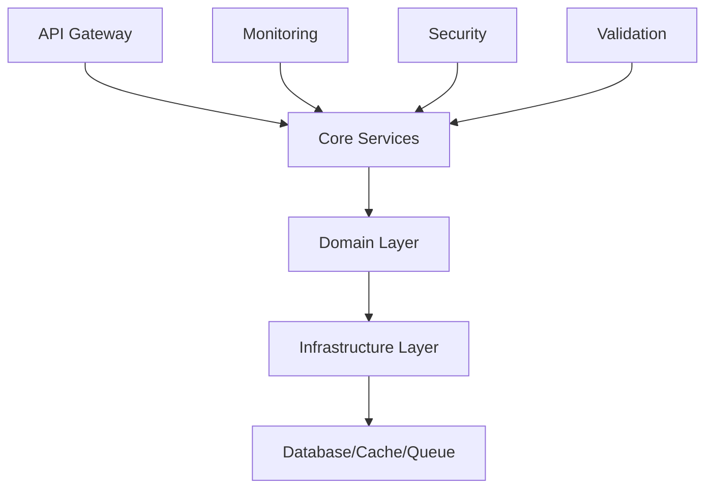

# 🏗️ Enterprise System Monorepo

[](https://github.com/KatarSaad/system-monorepo/actions)
[](https://opensource.org/licenses/MIT)
[](https://www.typescriptlang.org/)
[](https://nestjs.com/)

> A production-ready, enterprise-grade modular system built with Domain-Driven Design (DDD) principles, designed for easy transformation to microservices architecture.

## 📋 Table of Contents

- [🎯 Overview](#-overview)
- [🏛️ Architecture](#️-architecture)
- [📦 Packages](#-packages)
- [🚀 Quick Start](#-quick-start)
- [📚 Documentation](#-documentation)
- [🛠️ Development](#️-development)
- [🧪 Testing](#-testing)
- [🚢 Deployment](#-deployment)
- [🤝 Contributing](#-contributing)

## 🎯 Overview

This monorepo contains a comprehensive enterprise system with 20+ reusable packages, designed for:

- **Modular Architecture** - Independent, reusable packages
- **Domain-Driven Design** - Clean separation of business logic
- **Enterprise-Ready** - Production-grade patterns and practices
- **Developer Experience** - Comprehensive tooling and templates
- **Microservices Ready** - Easy transition from monolith to microservices

## 🏛️ Architecture



### Core Principles
- **SOLID Principles**
- **Clean Architecture**
- **Event-Driven Architecture**
- **CQRS Pattern**
- **Repository Pattern**

## 📦 Packages

| Package | Version | Description | Status |
|---------|---------|-------------|--------|
| [@system/core](./packages/core) |  | Core business logic and utilities | ✅ Stable |
| [@system/infrastructure](./packages/infrastructure) |  | Database and external integrations | ✅ Stable |
| [@system/security](./packages/security) |  | Authentication and authorization | ✅ Stable |
| [@system/monitoring](./packages/monitoring) |  | Metrics and observability | ✅ Stable |
| [@system/validation](./packages/validation) |  | Data validation and schemas | ✅ Stable |

[📋 View All Packages](./docs/packages/README.md)

## 🚀 Quick Start

### Prerequisites
- Node.js 18+
- npm/yarn/pnpm
- Docker (optional)

### Installation
```bash
# Clone repository
git clone https://github.com/KatarSaad/system-monorepo.git
cd system-monorepo

# Install dependencies
npm install

# Setup environment
cp .env.example .env

# Start development
npm run dev
```

### Docker Setup
```bash
# Start with Docker
docker-compose up -d

# View logs
docker-compose logs -f api
```

## 📚 Documentation

| Section | Description |
|---------|-------------|
| [📖 Getting Started](./docs/getting-started/README.md) | Installation and setup guide |
| [🏗️ Architecture](./docs/architecture/README.md) | System design and patterns |
| [📦 Package Guides](./docs/packages/README.md) | Individual package documentation |
| [🔧 Development](./docs/development/README.md) | Development workflow and tools |
| [🧪 Testing](./docs/testing/README.md) | Testing strategies and examples |
| [🚢 Deployment](./docs/deployment/README.md) | Production deployment guides |
| [📊 API Reference](./docs/api/README.md) | REST API documentation |

## 🛠️ Development

### Available Scripts
```bash
# Development
npm run dev              # Start development server
npm run build           # Build all packages
npm run test            # Run tests
npm run lint            # Lint code

# Package Management
npm run create:package  # Create new package
npm run publish         # Publish packages
npm run clean           # Clean build artifacts
```

### Project Structure
```
system-monorepo/
├── packages/           # Shared packages
│   ├── core/          # Core business logic
│   ├── infrastructure/ # Infrastructure layer
│   └── ...
├── services/          # Application services
│   └── api/          # REST API service
├── docs/             # Documentation
├── tools/            # Development tools
└── scripts/          # Build and deployment scripts
```

## 🧪 Testing

```bash
# Unit tests
npm run test:unit

# Integration tests
npm run test:integration

# E2E tests
npm run test:e2e

# Coverage
npm run test:coverage
```

## 🚢 Deployment

### Production Build
```bash
npm run build:prod
npm run start:prod
```

### Docker Deployment
```bash
docker build -t system-monorepo .
docker run -p 3000:3000 system-monorepo
```

[📋 Detailed Deployment Guide](./docs/deployment/README.md)

## 🤝 Contributing

We welcome contributions! Please see our [Contributing Guide](./CONTRIBUTING.md) for details.

### Development Workflow
1. Fork the repository
2. Create a feature branch
3. Make your changes
4. Add tests
5. Submit a pull request

## 📄 License

This project is licensed under the MIT License - see the [LICENSE](./LICENSE) file for details.

## 🔗 Links

- [📊 Live Demo](https://system-demo.example.com)
- [📚 Documentation](https://docs.system.example.com)
- [🐛 Issues](https://github.com/KatarSaad/system-monorepo/issues)
- [💬 Discussions](https://github.com/KatarSaad/system-monorepo/discussions)

---

<div align="center">
  <strong>Built with ❤️ by the System Team</strong>
</div>