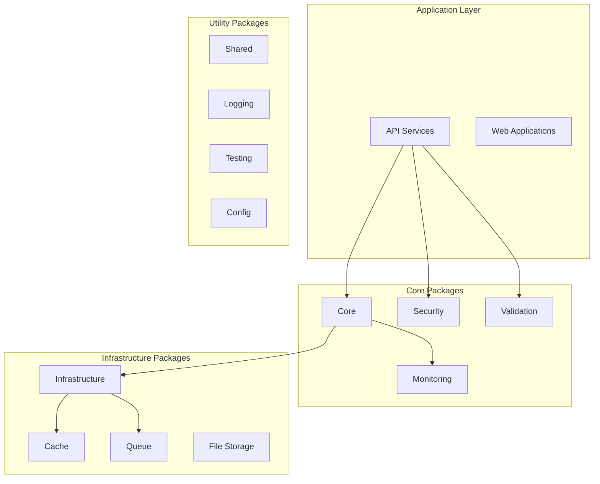
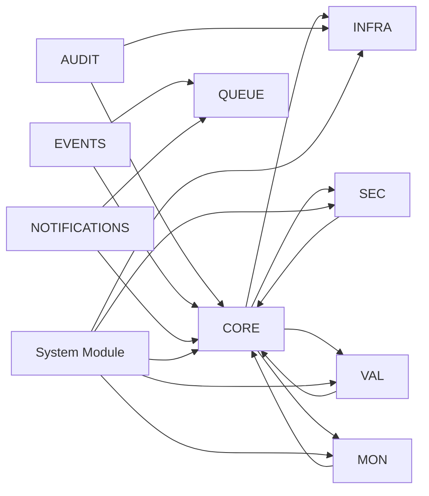

# 📦 Package Documentation

This section contains detailed documentation for all packages in the System Monorepo.

## 🏗️ Package Architecture



## 📋 Package Categories

### 🎯 Core Packages
Essential packages that provide fundamental functionality.

| Package | Description | Dependencies | Status |
|---------|-------------|--------------|--------|
| [**@system/core**](./core.md) | Core business logic, entities, and utilities | None | ✅ Stable |
| [**@system/shared**](./shared.md) | Common utilities and constants | None | ✅ Stable |
| [**@system/infrastructure**](./infrastructure.md) | Database and external integrations | @system/core | ✅ Stable |

### 🔒 Security & Validation
Packages focused on security, authentication, and data validation.

| Package | Description | Dependencies | Status |
|---------|-------------|--------------|--------|
| [**@system/security**](./security.md) | Authentication, authorization, encryption | @system/core | ✅ Stable |
| [**@system/validation**](./validation.md) | Data validation and schema management | @system/core | ✅ Stable |
| [**@system/audit**](./audit.md) | Audit logging and compliance | @system/core, @system/infrastructure | ✅ Stable |

### 📊 Monitoring & Observability
Packages for monitoring, logging, and system observability.

| Package | Description | Dependencies | Status |
|---------|-------------|--------------|--------|
| [**@system/monitoring**](./monitoring.md) | Metrics, tracing, and alerting | @system/core | ✅ Stable |
| [**@system/logging**](./logging.md) | Structured logging with multiple adapters | @system/core | ✅ Stable |
| [**@system/health**](./health.md) | Health checks and system status | @system/monitoring | ✅ Stable |

### 🚀 Performance & Scalability
Packages for performance optimization and scalability.

| Package | Description | Dependencies | Status |
|---------|-------------|--------------|--------|
| [**@system/rate-limiting**](./rate-limiting.md) | Rate limiting and throttling | @system/core, @system/monitoring | ✅ Stable |
| [**@system/queue**](./queue.md) | Job queues and background processing | @system/core, @system/monitoring | ✅ Stable |
| [**@system/search**](./search.md) | Full-text search and indexing | @system/infrastructure | ✅ Stable |

### 💾 Data & Storage
Packages for data management and storage solutions.

| Package | Description | Dependencies | Status |
|---------|-------------|--------------|--------|
| [**@system/file-storage**](./file-storage.md) | File upload and storage management | @system/core, @system/security | ✅ Stable |
| [**@system/backup**](./backup.md) | Data backup and recovery | @system/infrastructure, @system/security | ✅ Stable |
| [**@system/config**](./config.md) | Configuration management | @system/validation | ✅ Stable |

### 🔔 Communication & Events
Packages for messaging, notifications, and event handling.

| Package | Description | Dependencies | Status |
|---------|-------------|--------------|--------|
| [**@system/events**](./events.md) | Event sourcing and messaging | @system/core, @system/queue | ✅ Stable |
| [**@system/notifications**](./notifications.md) | Multi-channel notifications | @system/core, @system/queue | ✅ Stable |

### 🎛️ Feature Management
Packages for feature flags and system control.

| Package | Description | Dependencies | Status |
|---------|-------------|--------------|--------|
| [**@system/feature-flags**](./feature-flags.md) | Feature toggles and A/B testing | @system/core, @system/monitoring | ✅ Stable |

### 🧪 Development & Testing
Packages for development workflow and testing.

| Package | Description | Dependencies | Status |
|---------|-------------|--------------|--------|
| [**@system/testing**](./testing.md) | Testing utilities and mocks | @system/core | ✅ Stable |

### 🎯 System Integration
Meta-packages for system-wide integration.

| Package | Description | Dependencies | Status |
|---------|-------------|--------------|--------|
| [**@system/system-module**](./system-module.md) | Complete system integration | All packages | ✅ Stable |

## 🔧 Package Development

### Creating a New Package
```bash
# Generate package structure
npm run create:package my-new-package

# Navigate to package
cd packages/my-new-package

# Install dependencies
npm install

# Start development
npm run dev
```

### Package Structure
```
packages/my-package/
├── src/
│   ├── index.ts           # Main exports
│   ├── module.ts          # NestJS module
│   ├── services/          # Business logic
│   ├── interfaces/        # TypeScript interfaces
│   ├── decorators/        # Custom decorators
│   └── utils/            # Utility functions
├── tests/                # Test files
├── docs/                 # Package documentation
├── package.json          # Package configuration
├── tsconfig.json         # TypeScript config
└── README.md            # Package README
```

### Package Standards
- **TypeScript** - All packages use TypeScript
- **NestJS** - Follow NestJS patterns and conventions
- **Testing** - Minimum 80% test coverage
- **Documentation** - Comprehensive README and API docs
- **Versioning** - Semantic versioning (semver)

## 📊 Package Metrics

### Bundle Sizes
| Package | Minified | Gzipped | Tree-shakable |
|---------|----------|---------|---------------|
| @system/core | 45KB | 12KB | ✅ |
| @system/security | 23KB | 8KB | ✅ |
| @system/validation | 18KB | 6KB | ✅ |
| @system/monitoring | 31KB | 9KB | ✅ |

### Performance Benchmarks
- **Startup Time**: < 500ms
- **Memory Usage**: < 50MB base
- **Response Time**: < 100ms average

## 🔄 Package Dependencies



## 🚀 Getting Started with Packages

### Installation
```bash
# Install specific package
npm install @system/core

# Install multiple packages
npm install @system/core @system/security @system/validation
```

### Basic Usage
```typescript
import { CoreModule } from '@system/core';
import { SecurityModule } from '@system/security';
import { ValidationModule } from '@system/validation';

@Module({
  imports: [
    CoreModule.forRoot(),
    SecurityModule.forRoot({
      jwt: { secret: 'your-secret' }
    }),
    ValidationModule.forRoot()
  ]
})
export class AppModule {}
```

## 📚 Additional Resources

- [Package Development Guide](../development/package-creation.md)
- [Testing Packages](../testing/package-testing.md)
- [Publishing Packages](../development/publishing.md)
- [Migration Guide](../guides/migration.md)

---

**Questions?** Check our [FAQ](../guides/faq.md) or [open an issue](https://github.com/KatarSaad/system-monorepo/issues).