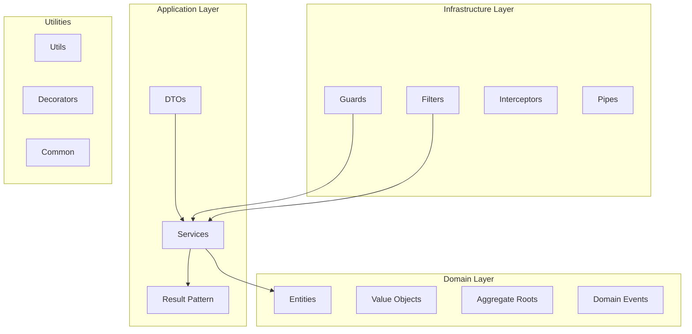

# @system/core

[](https://badge.fury.io/js/%40system%2Fcore)
[](https://opensource.org/licenses/MIT)
[](https://www.typescriptlang.org/)

> Core business logic, entities, and utilities for the System Monorepo.

## 📋 Table of Contents

- [Installation](#installation)
- [Features](#features)
- [Quick Start](#quick-start)
- [API Reference](#api-reference)
- [Examples](#examples)
- [Configuration](#configuration)
- [Contributing](#contributing)

## 🚀 Installation

```bash
npm install @system/core
# or
yarn add @system/core
# or
pnpm add @system/core
```

## ✨ Features

- **Domain-Driven Design** - Entities, Value Objects, Aggregates
- **Result Pattern** - Type-safe error handling
- **Base Services** - Common service patterns
- **Utilities** - String, Date, Array, Object helpers
- **Decorators** - Caching, Retry, Public access
- **DTOs** - Data Transfer Objects with validation
- **Guards & Filters** - Authentication and exception handling
- **Swagger Integration** - API documentation support

## 🏗️ Architecture



## 🚀 Quick Start

### Basic Module Setup

```typescript
import { Module } from '@nestjs/common';
import { CoreModule } from '@system/core';

@Module({
  imports: [
    CoreModule.forRoot({
      cache: {
        ttl: 300,
        max: 100
      },
      crypto: {
        algorithm: 'aes-256-gcm'
      }
    })
  ]
})
export class AppModule {}
```

### Using Domain Entities

```typescript
import { Entity, AggregateRoot } from '@system/core';

@Entity()
export class User extends AggregateRoot {
  constructor(
    public readonly id: string,
    public readonly email: string,
    public readonly name: string,
    private _isActive: boolean = true
  ) {
    super();
  }

  activate(): void {
    this._isActive = true;
    this.addDomainEvent(new UserActivatedEvent(this.id));
  }

  deactivate(): void {
    this._isActive = false;
    this.addDomainEvent(new UserDeactivatedEvent(this.id));
  }

  get isActive(): boolean {
    return this._isActive;
  }
}
```

### Result Pattern Usage

```typescript
import { Result, BaseService } from '@system/core';

@Injectable()
export class UserService extends BaseService<User> {
  async createUser(data: CreateUserDto): Promise<Result<User>> {
    try {
      // Validation
      if (!data.email) {
        return Result.fail('Email is required');
      }

      // Business logic
      const user = new User(
        this.generateId(),
        data.email,
        data.name
      );

      // Save user
      await this.repository.save(user);

      return Result.ok(user);
    } catch (error) {
      return Result.fail(`Failed to create user: ${error.message}`);
    }
  }

  async findById(id: string): Promise<Result<User | null>> {
    try {
      const user = await this.repository.findById(id);
      return Result.ok(user);
    } catch (error) {
      return Result.fail(`Failed to find user: ${error.message}`);
    }
  }
}
```

### Using Decorators

```typescript
import { Cache, Retry, Public } from '@system/core';

@Injectable()
export class ProductService {
  @Cache({ ttl: 300 }) // Cache for 5 minutes
  @Retry({ attempts: 3, delay: 1000 })
  async getProduct(id: string): Promise<Product> {
    return this.repository.findById(id);
  }

  @Public() // Skip authentication
  async getPublicProducts(): Promise<Product[]> {
    return this.repository.findPublic();
  }
}
```

## 📚 API Reference

### Core Classes

#### Entity
Base class for domain entities.

```typescript
abstract class Entity {
  abstract id: string;
  equals(other: Entity): boolean;
  toJSON(): object;
}
```

#### AggregateRoot
Base class for aggregate roots with domain events.

```typescript
abstract class AggregateRoot extends Entity {
  private _domainEvents: DomainEvent[] = [];
  
  addDomainEvent(event: DomainEvent): void;
  clearEvents(): void;
  getUncommittedEvents(): DomainEvent[];
}
```

#### Result<T>
Type-safe error handling pattern.

```typescript
class Result<T> {
  static ok<U>(value: U): Result<U>;
  static fail<U>(error: string): Result<U>;
  
  isSuccess: boolean;
  isFailure: boolean;
  value: T;
  error: string;
}
```

### Services

#### BaseService<T>
Abstract base service with common CRUD operations.

```typescript
abstract class BaseService<T extends Entity> {
  abstract create(data: Partial<T>): Promise<Result<T>>;
  abstract findById(id: string): Promise<Result<T | null>>;
  abstract update(id: string, data: Partial<T>): Promise<Result<T>>;
  abstract delete(id: string): Promise<Result<boolean>>;
}
```

#### CacheService
Redis-based caching service.

```typescript
class CacheService {
  async get<T>(key: string): Promise<T | null>;
  async set<T>(key: string, value: T, ttl?: number): Promise<void>;
  async del(key: string): Promise<void>;
  async clear(): Promise<void>;
}
```

#### CryptoService
Encryption and hashing utilities.

```typescript
class CryptoService {
  encrypt(text: string, key?: string): string;
  decrypt(encryptedText: string, key?: string): string;
  hash(text: string): string;
  compare(text: string, hash: string): boolean;
  generateKey(): string;
}
```

### Utilities

#### String Utils
```typescript
class StringUtils {
  static toCamelCase(str: string): string;
  static toSnakeCase(str: string): string;
  static toPascalCase(str: string): string;
  static slugify(str: string): string;
  static truncate(str: string, length: number): string;
}
```

#### Date Utils
```typescript
class DateUtils {
  static format(date: Date, format: string): string;
  static addDays(date: Date, days: number): Date;
  static isWeekend(date: Date): boolean;
  static getAge(birthDate: Date): number;
}
```

#### Array Utils
```typescript
class ArrayUtils {
  static chunk<T>(array: T[], size: number): T[][];
  static unique<T>(array: T[]): T[];
  static groupBy<T>(array: T[], key: keyof T): Record<string, T[]>;
  static shuffle<T>(array: T[]): T[];
}
```

### Decorators

#### @Cache(options)
Cache method results.

```typescript
interface CacheOptions {
  ttl?: number;        // Time to live in seconds
  key?: string;        // Custom cache key
  condition?: boolean; // Conditional caching
}
```

#### @Retry(options)
Retry failed operations.

```typescript
interface RetryOptions {
  attempts: number;    // Number of retry attempts
  delay: number;       // Delay between attempts (ms)
  backoff?: boolean;   // Exponential backoff
}
```

#### @Public()
Skip authentication for endpoints.

```typescript
@Public()
@Get('health')
async healthCheck() {
  return { status: 'ok' };
}
```

## 🔧 Configuration

### Module Configuration

```typescript
interface CoreModuleOptions {
  cache?: {
    ttl: number;
    max: number;
    redis?: {
      host: string;
      port: number;
      password?: string;
    };
  };
  crypto?: {
    algorithm: string;
    key?: string;
  };
  logging?: {
    level: 'debug' | 'info' | 'warn' | 'error';
    format: 'json' | 'simple';
  };
}
```

### Environment Variables

```bash
# Cache Configuration
CACHE_TTL=300
CACHE_MAX_ITEMS=1000
REDIS_URL=redis://localhost:6379

# Crypto Configuration
CRYPTO_ALGORITHM=aes-256-gcm
CRYPTO_KEY=your-secret-key

# Logging Configuration
LOG_LEVEL=info
LOG_FORMAT=json
```

## 📖 Examples

### Complete User Management Example

```typescript
// user.entity.ts
import { Entity, AggregateRoot, DomainEvent } from '@system/core';

export class UserCreatedEvent extends DomainEvent {
  constructor(public readonly userId: string) {
    super();
  }
}

@Entity()
export class User extends AggregateRoot {
  constructor(
    public readonly id: string,
    public readonly email: string,
    public readonly name: string,
    private _isActive: boolean = true,
    private _createdAt: Date = new Date()
  ) {
    super();
    this.addDomainEvent(new UserCreatedEvent(id));
  }

  // Business methods
  activate(): void {
    this._isActive = true;
  }

  deactivate(): void {
    this._isActive = false;
  }

  // Getters
  get isActive(): boolean {
    return this._isActive;
  }

  get createdAt(): Date {
    return this._createdAt;
  }
}

// user.service.ts
import { Injectable } from '@nestjs/common';
import { BaseService, Result, Cache, Retry } from '@system/core';

@Injectable()
export class UserService extends BaseService<User> {
  @Cache({ ttl: 300 })
  async findById(id: string): Promise<Result<User | null>> {
    try {
      const user = await this.repository.findById(id);
      return Result.ok(user);
    } catch (error) {
      return Result.fail(`User not found: ${error.message}`);
    }
  }

  @Retry({ attempts: 3, delay: 1000 })
  async create(data: CreateUserDto): Promise<Result<User>> {
    try {
      // Validation
      const validation = await this.validateUserData(data);
      if (validation.isFailure) {
        return Result.fail(validation.error);
      }

      // Create user
      const user = new User(
        this.generateId(),
        data.email,
        data.name
      );

      // Save
      await this.repository.save(user);

      return Result.ok(user);
    } catch (error) {
      return Result.fail(`Failed to create user: ${error.message}`);
    }
  }

  private async validateUserData(data: CreateUserDto): Promise<Result<boolean>> {
    if (!data.email || !data.name) {
      return Result.fail('Email and name are required');
    }

    const existingUser = await this.repository.findByEmail(data.email);
    if (existingUser) {
      return Result.fail('User with this email already exists');
    }

    return Result.ok(true);
  }
}

// user.controller.ts
import { Controller, Get, Post, Body, Param } from '@nestjs/common';
import { ApiTags, ApiOperation, ApiResponse } from '@nestjs/swagger';
import { Public, ApiResponseDto } from '@system/core';

@ApiTags('Users')
@Controller('users')
export class UserController {
  constructor(private readonly userService: UserService) {}

  @Post()
  @ApiOperation({ summary: 'Create a new user' })
  @ApiResponse({ status: 201, description: 'User created successfully' })
  async create(@Body() createUserDto: CreateUserDto): Promise<ApiResponseDto<User>> {
    const result = await this.userService.create(createUserDto);
    
    if (result.isFailure) {
      return ApiResponseDto.error(result.error);
    }

    return ApiResponseDto.success(result.value, 'User created successfully');
  }

  @Get(':id')
  @Public()
  @ApiOperation({ summary: 'Get user by ID' })
  async findById(@Param('id') id: string): Promise<ApiResponseDto<User>> {
    const result = await this.userService.findById(id);
    
    if (result.isFailure) {
      return ApiResponseDto.error(result.error);
    }

    if (!result.value) {
      return ApiResponseDto.error('User not found');
    }

    return ApiResponseDto.success(result.value);
  }
}
```

## 🧪 Testing

```typescript
// user.service.spec.ts
import { Test, TestingModule } from '@nestjs/testing';
import { UserService } from './user.service';
import { TestingModule as SystemTestingModule } from '@system/testing';

describe('UserService', () => {
  let service: UserService;
  let module: TestingModule;

  beforeEach(async () => {
    module = await Test.createTestingModule({
      imports: [SystemTestingModule.forTest()],
      providers: [UserService],
    }).compile();

    service = module.get<UserService>(UserService);
  });

  afterEach(async () => {
    await module.close();
  });

  describe('create', () => {
    it('should create a user successfully', async () => {
      const userData = {
        email: 'test@example.com',
        name: 'Test User'
      };

      const result = await service.create(userData);

      expect(result.isSuccess).toBe(true);
      expect(result.value.email).toBe(userData.email);
      expect(result.value.name).toBe(userData.name);
    });

    it('should fail with invalid data', async () => {
      const userData = {
        email: '',
        name: 'Test User'
      };

      const result = await service.create(userData);

      expect(result.isFailure).toBe(true);
      expect(result.error).toContain('Email and name are required');
    });
  });
});
```

## 🤝 Contributing

1. Fork the repository
2. Create your feature branch (`git checkout -b feature/amazing-feature`)
3. Commit your changes (`git commit -m 'Add some amazing feature'`)
4. Push to the branch (`git push origin feature/amazing-feature`)
5. Open a Pull Request

## 📄 License

This project is licensed under the MIT License - see the [LICENSE](../../LICENSE) file for details.

## 🔗 Related Packages

- [@system/infrastructure](../infrastructure/README.md) - Database and external integrations
- [@system/security](../security/README.md) - Authentication and authorization
- [@system/validation](../validation/README.md) - Data validation and schemas
- [@system/monitoring](../monitoring/README.md) - Metrics and observability

---

**Need help?** Check our [documentation](../../docs/README.md) or [open an issue](https://github.com/KatarSaad/system-monorepo/issues).